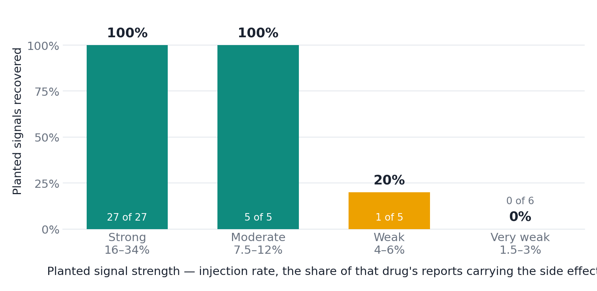
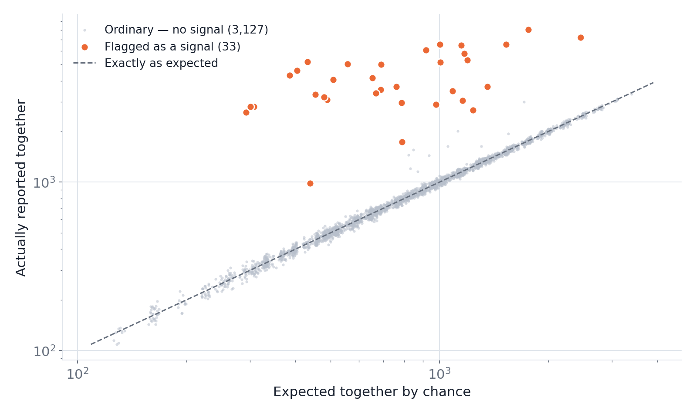

# AEGIS — Adverse Event Global Intelligence System

**Sanjay Salvi** · [github.com/sanjay2002salvi-afk](https://github.com/sanjay2002salvi-afk)

### The evidence is already public. How long does it sit there unread?

Every few months a drug gets a new safety warning. Almost every time, the reports
describing that exact harm had been sitting in a free, public FDA database for
years beforehand — nobody was counting them in a way that made the pattern visible.

That gap is rarely measured end to end. **This project builds the instrument that
measures it** — and characterises the instrument against known answers before pointing
it at anything real.

AEGIS is a SQL warehouse over FDA-format adverse-event reports that computes, for any
drug–side-effect pair, the exact quarter the evidence first became statistically
detectable — and then scores itself against known answers to prove the detector
works.

---

### Why it is hard

Three things at once:

- **No denominator.** FAERS records problems, never safe use. You learn that 1,400
  people reported a tendon rupture on a drug; you never learn how many took it and
  were fine. Absolute risk is permanently uncomputable.
- **A brutal base rate.** Real drug–side-effect associations are rare among all the
  pairs you have to test. The corpus here reproduces that on purpose: 43 real among
  3,160 candidates, about 1 in 73. *(That ratio is a design parameter I chose, not a
  measurement — but it is the regime the problem actually lives in, and at that rate
  precision is decided by your false-positive rate, not by how many real ones you
  catch.)*
- **No agreed labels.** Curated reference sets do exist (OMOP, EU-ADR), but they are
  small, contested and drug-class specific, so precision and recall on real FAERS are
  effectively unmeasurable inside a self-contained project. Most analyses therefore
  report findings without a measurable precision.

### The headline

Against a corpus with **43 signals planted among 3,160 candidates at deliberately
varying strengths**, the pipeline recovers **33 of 43 with zero false positives** —
and, more usefully, it tells you exactly where it stops working.

| Planted signal strength | Excess reporting | Planted | Found | Recall |
|---|---|---:|---:|---:|
| Strong | 16–34% | 27 | 27 | **100%** |
| Moderate | 7.5–12% | 5 | 5 | **100%** |
| Weak | 4–6% | 5 | 1 | 20% |
| Very weak | 1.5–3% | 6 | 0 | 0% |

**What "signal strength" means here.** It is the **injection rate**: the share of that
drug's reports carrying the planted side effect on top of its normal background. It is
*not* a percentage change in the reporting ratio. At the 7.5% floor the association
surfaces in the output as roughly a **2.2x** reporting ratio; the strongest planted
signals reach 12x.

**The claim to quote is not "100% accurate".** It is: *reliably detects a side effect
present in 7.5% or more of a drug's reports — about a 2x reporting ratio — with zero
false alarms across 3,160 candidates.* A method with no stated operating limit has
simply not been characterised.

Two further results worth the space:

- **Six detected pairs were deliberately withheld from the 27-item FDA reference set.**
  All six — sertraline/hyponatraemia, apixaban/GI haemorrhage, adalimumab/pneumonia
  and three others — *are* FDA-labelled in the real world. They were held out so the
  pipeline had something to return from outside its own answer key. **These are not
  discoveries.** They are a capability check: a detector that can only rediscover the
  contents of its reference set has not been shown to generalise, and this is how you
  show that it does.
- **Every missed pair still satisfied 2 of the 3 statistical criteria.** They fail only
  the one demanding a *large* effect — the same rule that holds false positives at
  zero. The misses are the price of the precision, and that trade is explicit.

Getting here required finding that my own first version was wrong: it flagged 61
pairs, of which 18 were spurious. Two of the three criteria had no minimum effect
size, and at N = 373,446 an **8% elevation** clears both. That diagnosis, not any
final score, is the interesting part.

> **Read the caveats with the numbers.** The corpus is synthetic — which is the point,
> because planted ground truth is the only way to compute real precision and recall,
> or to draw a detection curve at all. Full limitations at the bottom.

> **[Open the results dashboard →](docs/dashboard/AEGIS-dashboard.html)**
> — one page, no install, no database. Or read
> [`docs/START-HERE.md`](docs/START-HERE.md) for the 19-slide explainer and the
> guided tour.



*The headline result: perfect recall above a 7.5% injection rate, degrading sharply
below it. Publishing where a method stops working is the point.*

---

## Contents

- [Why this problem](#why-this-problem)
- [Results](#results)
- [Architecture](#architecture)
- [Quick start](#quick-start-5-minutes)
- [The four statistics](#the-four-statistics)
- [Three things that were harder than expected](#three-things-that-were-harder-than-expected)
- [Repository layout](#repository-layout)
- [Limitations](#limitations-read-before-citing-anything)

---

## Why this problem

A clinical trial enrols a few thousand patients for a few months. That is enough to
find side effects occurring in 1 patient in 100. It is nowhere near enough to find
one occurring in 1 in 10,000, or one that takes three years to develop, or one that
only affects pregnant women — because the trial contained neither enough people nor
enough time nor those people at all.

So the real safety profile of a drug is discovered *after* approval, from
spontaneous reports filed by clinicians, patients and manufacturers. The FDA
Adverse Event Reporting System holds over 20 million of them.

The analytical difficulty is that FAERS has **no denominator**. It records that
1,400 people reported a tendon rupture while taking levofloxacin. It does not record
how many people took levofloxacin. Absolute risk is therefore uncomputable, and any
statement like "this drug causes X in 2% of patients" is unsupportable from this
data.

What *is* computable is **disproportionality**: whether a reaction is reported more
often with one drug than with all other drugs. That comparison is internal to the
reporting system, so the unknown denominator cancels. Every metric in this project
is a variation on that single idea.

This matters because it is how post-market drug safety actually works. Montelukast
(Singulair), an asthma drug taken by millions of children, received an FDA
[boxed warning for serious neuropsychiatric events in March 2020](https://www.fda.gov/drugs/fda-requires-boxed-warning-about-serious-mental-health-side-effects-asthma-and-allergy-drug)
— years after the reports began accumulating. Febuxostat (Uloric) received a
[boxed warning for cardiovascular death in February 2019](https://www.fda.gov/drugs/drug-safety-and-availability).
The reports were in the system before the warning was on the label. The question
this project asks is how early a disciplined statistical screen would have seen them.

---

## Results

Measured on the reproducible demo corpus (25 quarters, 373,446 cases,
3.19M fact rows). Every figure is regenerated on each run — see
[`docs/engineering/performance.md`](docs/engineering/performance.md).

### Detection accuracy

| Metric | Value |
|---|---:|
| Drug–reaction pairs evaluated | 3,160 |
| True signals planted (4 strength tiers) | 43 |
| True positives | **33** |
| False positives, current alert list | **0** |
| False positives, ever-flagged over 25 quarters | 3 |
| False negatives | 10 (4 weak-tier, 6 very weak) |
| Precision (current alert list) | **100%** |
| Precision (ever-flagged) | 91.7% (33/36) |
| Recall, strong + moderate tiers | **100%** |
| Recall, all tiers pooled | 76.7% |
| Detection floor | **7.5% injection rate** |
| Held-out pairs recovered (capability check) | **6** |
| Mean detection lag | 2.76 quarters |

Detection lag behaves the way real pharmacovigilance does: rare, distinctive
reactions surface fastest. `MONTELUKAST → NIGHTMARE` was detected **1 quarter**
after emergence, while `MONTELUKAST → DEPRESSION` took **6** — same drug, same
planted strength, but depression has a high background reporting rate across all
drugs, so the signal must climb out of a much noisier baseline first. The long tail
of the lag distribution is the weak-tier signals: less excess reporting means more
quarters of evidence needed before the threshold is crossed.

### Data quality

| Metric | Value |
|---|---:|
| Source rows ingested | 5,260,306 |
| Raw case-version rows | 420,230 |
| Rows removed as duplicates / retractions | **46,784 (11.1%)** |
| Cases in final analysis population | 373,446 |
| Quality-gate assertions passing | **12 / 12** |
| Drug-name mapping coverage (row-weighted) | **100%** |

### Performance

| Operation | Result |
|---|---:|
| Full pipeline, empty database → dashboard-ready | **7 min 23 s** |
| Staging ingest throughput | ~41,000 rows/s |
| Severity roll-up, covering index vs row lookups | **14,741 ms → 6,869 ms (2.1×)** |
| Partition pruning active vs defeated | **803 ms → 163 ms (4.9×)** |

---

## Architecture

```
FDA FAERS quarterly ASCII extracts  (8 files × N quarters, '$'-delimited)
        │
        ▼
  ┌─────────────────┐   raw landing zone — every column VARCHAR, nothing coerced,
  │  01_staging     │   so malformed rows arrive intact and get COUNTED
  └────────┬────────┘
           ▼
  ┌─────────────────┐   case-version resolution · FDA retraction handling
  │  02_quality     │   12 executable assertions, FAIL severity aborts the run
  └────────┬────────┘
           ▼
  ┌─────────────────┐   free-text drug names → active ingredients
  │  03_reference   │   5-rung resolution ladder, coverage measured not assumed
  └────────┬────────┘
           ▼
  ┌─────────────────┐   Kimball star · grain: (case, ingredient, MedDRA PT)
  │  04_warehouse   │   PK enforces the grain · RANGE partitioned by year
  │  05_transform   │
  └────────┬────────┘
           ▼
  ┌─────────────────┐   PRR · ROR + 95% CI · Yates χ² · BCPNN IC
  │  06_signal      │   cumulative quarterly series, one pass + window functions
  └────────┬────────┘
           ▼
  ┌─────────────────┐   Mode A: lag vs planted truth (synthetic)
  │  07_backtest    │   Mode B: lead time vs real FDA action dates
  └────────┬────────┘
           ▼
  ┌─────────────────┐   narrow materialised tables (MySQL has no matviews)
  │  08_semantic    │   3,160 rows exposed to BI, not 3.19M
  └────────┬────────┘
           ▼
      Power BI  ·  4 pages  ·  see powerbi/README.md
```



*Every one of the 3,160 candidate pairs. The diagonal is "exactly as chance predicts";
the points that break away from it are the signals.*

**Stack:** MySQL 8.0 (window functions, CTEs, stored procedures, RANGE
partitioning, generated columns) · Power BI · Python only as a byte-mover for
ingestion — all analysis is SQL, by design.

---

## Quick start

Requires MySQL 8.0+ and Python 3.9+. No FDA download needed for the demo.

```bash
git clone https://github.com/sanjay2002salvi-afk/Adverse-Event-Global-Intelligence-System.git
cd Adverse-Event-Global-Intelligence-System
pip install -r requirements.txt

cp config/db.example.env config/db.env      # edit credentials

python etl/make_demo_corpus.py              # synthetic FAERS-shaped corpus
python run_pipeline.py --demo               # full pipeline, ~7.5 minutes
```

To browse the shipped results without MySQL:

```bash
python serve_dashboard.py                   # http://127.0.0.1:43147
```

That builds the complete warehouse and prints the accuracy table above.

### Running on real FDA data

```bash
python etl/download_faers.py 2019Q1 2025Q1  # ~2 GB, from fis.fda.gov
python run_pipeline.py                      # same SQL, real data
```

Backtest Mode B (lead time vs real FDA action dates) activates automatically and
is deliberately **suppressed** on synthetic data — comparing fabricated report
dates against real regulatory dates would produce a number that means nothing.

---

## The four statistics

For drug **D** and reaction **E**, counting *cases*:

|  | reaction E | not E | total |
|---|---:|---:|---:|
| **drug D** | a | b | a+b |
| **not D** | c | d | c+d |
| **total** | a+c | b+d | N |

| Statistic | Formula | Signals when |
|---|---|---|
| **PRR** — Proportional Reporting Ratio (MHRA) | `[a/(a+b)] / [c/(c+d)]` | a ≥ 3, PRR ≥ 2, χ² ≥ 4 |
| **ROR** — Reporting Odds Ratio (EMA) | `ad / bc` | a ≥ 3, lower 95% CI > 1 |
| **χ²** — Yates-corrected | `N(\|ad−bc\| − N/2)² / ((a+b)(c+d)(a+c)(b+d))` | ≥ 3.84 |
| **IC** — Information Component (Uppsala BCPNN) | `log₂[(a+0.5)/(E+0.5)]` | IC₀₂₅ > 0 |

Four rather than one because they disagree in informative ways. ROR is
better-behaved when the *reaction* is rare; PRR is more stable when the *drug* is
rare; χ² guards against extreme ratios built from tiny counts; IC applies Bayesian
shrinkage and is the only one honest about a=3 being weak evidence no matter how
extreme the ratio looks.

The shipped operating point requires **all three criteria to agree** — for a
measured reason, described next.

---

## Three things that were harder than expected

These are the parts worth talking about, because each was a real bug caught by
measurement rather than by reading the code.

### 1. Statistical significance stopped being evidence of importance

The obvious operating point — "at least 2 of the 3 criteria fire" — gave **recall 100% but precision 64.2%**. Eighteen false positives out of sixty-one detections.

Inspecting them showed every single one had **PRR between 1.08 and 1.20** on
co-report counts in the hundreds or thousands. Not an arithmetic bug: two of the
three criteria (ROR lower CI > 1, and IC₀₂₅ > 0) test only whether an association
is *distinguishable from none*. Neither carries a minimum effect size. At
N = 373,446 the confidence intervals are narrow enough that an **8% elevation**
clears both. Only Evans's PRR criterion has an effect-size floor (PRR ≥ 2), and at
"2 of 3" the two significance-only criteria could outvote it.

Requiring consensus of all three makes the effect-size floor mandatory. Result:
**precision 100% with recall falling to 76.7% — a real trade, and the 10 lost are 4 weak-tier and 6 very weak.**

The transferable lesson: as N grows, a p-value stops measuring importance. Any
screening rule meant to survive scale needs an effect-size threshold, not just a
confidence bound.

### 2. A quality gate that could never fire

The gate detecting field corruption — FAERS free text sometimes contains an
unescaped `$`, which shifts every later field on that row — reported exactly
`0.0000` on a corpus with a *known* 3% corruption rate.

The probe column was `role_cod`, column 4. The corruption originates in
`drugname`, column 5. **A delimiter injected into column 5 cannot disturb
column 4.** The gate was structurally incapable of firing.

Moving the probe to `val_vbm` (column 7, closed domain `{1,2}`) made it fire — but
at 0.90%, still not 3%. Because `prod_ai` is only ~55% populated, a shifted row
often lands an *empty string* in the probe, which the domain test excludes.
Probing one column further along at `route`, which receives the always-populated
`val_vbm`, recovered the true **3.00%**.

Generalised rule now written into the code: *a domain probe is only as sensitive as
the fill rate of the column that shifts into it.* Choose densely-populated probes,
positioned after the free-text field.

### 3. Both sides of a join must pass through the same normaliser

`Z-PAK` (a brand of azithromycin) normalises to `Z PAK` once punctuation is
stripped. The brand lookup table stored the key as `Z-PAK`. They never matched, and
7,871 drug rows silently fell to "unmapped".

Silently is the problem. Nothing errors. The drug simply splits across surface
forms, each fragment falls below the detection threshold, and **a real signal
disappears without a trace** — the single most dangerous failure mode in this
project, because absence produces no evidence of itself.

The fix was structural rather than a patched-up special case: the normalisation
transform is defined once and applied to *both* the probe and the lookup keys
(`ref_brand_normalised`). Coverage went from 99.37% to 100%, and that class of bug
became impossible rather than merely absent.

A related find: the highest-confidence mapping rung (`L1_PROD_AI`) was gated on
`n_shift_suspect = 0` for the whole drug name. Since corruption is randomly
distributed, that was true for **zero of 123** drug names — one bad row anywhere
disabled the best rung for the entire drug. Filter at the source, not at the
aggregate.

---

## Repository layout

```
docs/
  START-HERE.md          read this first — index of everything below
  presentation/          19-slide explainer (.pptx + .pdf), speaker notes included
  dashboard/             self-contained HTML results page, opens in any browser
  diagrams/              charts embedded above, rendered from the same warehouse
  engineering/           measured performance evidence, critical review

sql/
  00_setup/              database, run ledger, ingestion ledger
  01_staging/            raw landing tables — no type coercion, on purpose
  02_quality/            case-version dedup, FDA retractions, 12 assertions
  03_reference/          brand→ingredient vocabularies, normalisation ladder
  04_warehouse/          star schema DDL (dimensions, partitioned fact)
  05_transform/          staging → warehouse ETL
  06_signal/             PRR / ROR / χ² / IC engine + quarterly series
  07_backtest/           FDA action reference set, two-mode backtest
  08_semantic/           narrow materialised tables for BI + detection curve
  09_optimization/       index strategy + reproducible benchmark

etl/                     download, bulk load, demo corpus generator
tests/                   planted ground truth + detection-curve evaluation
powerbi/flat/            five ready-to-load CSVs (no joins needed)
run_pipeline.py          one command, all stages, quality-gated
```

---

## Who did what

| Area | Owner |
|---|---|
| Data engineering, SQL warehouse, signal engine, BI layer | Sanjay Salvi |
| FDA regulatory reference set — sourcing and dating documented safety actions | open |
| MedDRA term → System Organ Class mapping, clinical plausibility review of flagged pairs | open |
| Confounding-by-indication analysis against the `INDI` table | open |

The three open workstreams are deliberately scoped to be independently checkable and
to need pharmacology rather than SQL:

1. **Widen the reference set.** `sql/07_backtest/01_fda_safety_actions.sql` holds 27
   dated, sourced FDA actions. Every pair added widens the Mode B backtest, and the
   size of that table is currently the binding constraint on what the project can
   claim about lead time.
2. **Clinical coherence.** A drug whose flagged reactions cluster inside one organ
   class is far more plausible than one scattered at random. `ref_meddra_soc` in
   `sql/03_reference/01_reference_data.sql` is the lever.
3. **Confounding by indication** — the single most important caveat in the project,
   currently asserted rather than analysed. The `INDI` table (why the drug was
   prescribed) is already loaded and unused; it is the whole answer.

## Limitations (read before citing anything)

1. **The demo corpus is synthetic.** It is FAERS-*shaped*, not FAERS. Its purpose
   is reproducibility and correctness testing against known truth. No result from
   it is a real pharmacovigilance finding. The planted *associations* are modelled
   on genuine documented ones; the *reports* are fabricated.

2. **Disproportionality is not causality.** Confounding by indication (the disease
   causes the event, not the drug), notoriety bias (publicity drives reporting), and
   litigation-driven reporting all produce genuine disproportionality with no causal
   link. This project says *signal*, never *causes*, and the distinction is
   load-bearing.

3. **FAERS has no denominator.** Incidence and absolute risk cannot be computed
   from this data by any method. Only relative reporting patterns.

4. **A lead time over an FDA action is not "beating the FDA".** Regulators act on
   randomised trials, observational studies and advisory committees, deliberately
   and slowly. That a statistical screen sees something earlier is expected, and is
   not a claim of superior judgement.

5. **The FDA reference set is a set of confirmed true positives**, so scoring
   against it measures sensitivity only. The false-positive rate is measured
   separately, against planted ground truth.

6. **It misses weak signals, and the boundary is published rather than hidden.**
   Below a 7.5% injection rate, recall drops to 20%; below 3% it detects
   nothing. This is a deliberate trade: the effect-size threshold causing those
   misses is the same one keeping false positives at zero across 3,160 candidates.

7. **Lead time against real FDA action dates has not been measured.** The backtest
   implements it (Mode B, `sql/07_backtest/02_backtest.sql`) but deliberately refuses
   to emit a number on synthetic data, and the pipeline has not yet been run against
   real FAERS. **No lead-time figure is claimed anywhere in this repository.** Every
   timing figure quoted is detection lag against the *planted* emergence quarter —
   detector latency, not the real-world gap.

8. **Reporting is voluntary and biased.** Serious events are over-reported relative
   to mild ones; US reports dominate; reporting rises with media attention. All
   estimates inherit these biases.

---

## Sources

- [FDA FAERS quarterly data extracts](https://fis.fda.gov/extensions/FPD-QDE-FAERS/FPD-QDE-FAERS.html)
- [FDA — boxed warning for montelukast neuropsychiatric events (March 2020)](https://www.fda.gov/drugs/fda-requires-boxed-warning-about-serious-mental-health-side-effects-asthma-and-allergy-drug)
- [FDA Drug Safety and Availability communications](https://www.fda.gov/drugs/drug-safety-and-availability)
- Evans SJW, Waller PC, Davis S. *Use of proportional reporting ratios (PRRs) for
  signal generation from spontaneous adverse drug reaction reports.*
  Pharmacoepidemiol Drug Saf. 2001;10(6):483–486.
- Bate A, Evans SJW. *Quantitative signal detection using spontaneous ADR
  reporting.* Pharmacoepidemiol Drug Saf. 2009;18(6):427–436.
- van Puijenbroek EP et al. *A comparison of measures of disproportionality for
  signal detection in spontaneous reporting systems.* Pharmacoepidemiol Drug Saf.
  2002;11(1):3–10.

---

## License

MIT — see [LICENSE](LICENSE).
